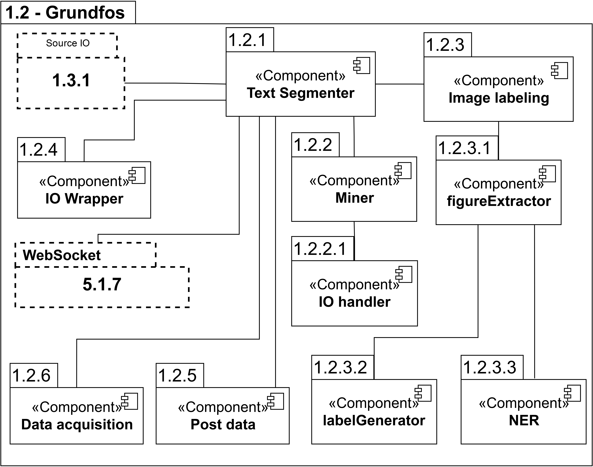

# Introduction
Grundfos is the largest pump manufacturer in the world, and understandably so has a lot of manuals for said pumps. Each grundfos manual comes in *.PDF* file format, where the task of this project is to process the PDF files and extract all the necessary information, and then pass it along in the *.JSON* file format for the next layer to commence their part of the work on. The GitHub repository **PreprocessingLayer_Grundfos** is, alongside the [**PreprocessingLayer_Nordjyske**](https://github.com/Knox-AAU/nordjyske-preprocessing) repository, the ones responsible for handling all input from the beginning of the KNOX pipeline.

# Components
The GitHub repository for Grundfos preprocessing may seem overwhelming at first, given its many **.py** files, which is why many of the files are categorised under the same component. An illustration of all the main components can be seen in the figure below.



Before addressing our components, it is highly suggested to get an understanding of how the KNOX Source IO components works, as it was created in collaboration with other groups.

- [The KNOX Source IO Repository](https://repos.knox.cs.aau.dk/knox-source-data-io/)
- [GitHub Repository](https://github.com/Knox-AAU/PreprocessingLayer_Source_Data_IO)

> Make sure to coordinate with the other PreprocessingLayer group, if you wish to change anything, as it is shared between both groups!

The execution point of the program happens inside the **Text Segmenter (1.2.1)** component, with the ``segment.py`` python module. Inside ``segment.py`` is the **WebSocket (5.1.7)**, which is the source for communication between the KNOX User Interface and this repository. In order to start processing, you first need to acquire some grundfos manuals, and this is done with the use of the **Data acquisition (1.2.6)** component, which is essentially just a simple webscraper that sends an **HTTP GET-Request** to the [**Grundfos API**](http://net.grundfos.com/Appl/ccmsservices/public/) via ``/literature/{fileName}``. In order to extract text from the provided manuals, the **Miner (1.2.2)** component is utilised, which is essentially built with the usage of the PDFMiner library. The format in which the text is outputted in, is then decided with the usage of the **IO Handler (1.2.2.1)** component, which is a class from the KNOX Source IO repository. From here on out, if you wish to send the data to the next layer in the pipeline **(Knowledge Layer)**, you can utilise the **Post Data (1.2.5)** component.

## Status of Image labeling components
The last couple of components **(1.2.3), (1.2.3.1), (1.2.3.2) and (1.2.3.3)**, are used independently from the rest of the components, as it is a work-in-progress, and the next layers in the pipeline has yet to be ready for images. The idea is that these images can then be portrayed on the website, alongside the meaningful text from each manual, as it is near impossible to understand the instructions in the manual, without the image and vice versa.

## The Main Components

The components are able to extract text, images, tables and titles from the PDF files. This repository consists of three main components, in addition to a few libraries and utilities:
- The **Data acquisition (1.2.6)** component iteratively sends an HTTP Get Request to the Grundfos API, and stores the response in the input folder.
- The **Text Segmenter (1.2.1)** component recursively scans the document to find and segment text into their correct sections or subsections.
- The **Post Data (1.2.5)** component is used to send data to the next layer in the pipeline **(Knowledge Layer)**, with the help of the [FileTransfer API](https://wiki.knox.cs.aau.dk/Utility-APIs/File-API).

# Dependencies
Majoirty of the dependencies are handled through the **requirements.txt** file. There are a few exceptions such as Ghostscript and Open CV, which are downloaded in isolation from the file, due to some discovered under troubleshooting. If you need to add more of these kinds of dependencies, that wont work through the **requirements.txt** file, you can add them to the **Dockerfile**.

> **Remember Version Control!**
If you add or modify existing libraries, make sure to write down the correct versions, otherwise the code-base might not function as intended.

To ensure correct versions for when the project is near its end, run the following command:

```
pip freeze > requirements.txt
```

# Installation
**Clone** the repository:
```
git clone https://github.com/Knox-AAU/PreprocessingLayer_Grundfos
```
To update the source code to the latest commit run the following command in the project directory:
```
git pull
```

Change directory to the project root, such that the following docker commands are executed in the same location as where the Dockerfile resides.

1. **Install** [Docker for Desktop](https://www.docker.com/products/docker-desktop)
   1. Make sure to enable [Virtualization](https://docs.docker.com/desktop/windows/troubleshoot/#virtualization) on your Setup, otherwise Docker will not work!
   2. For general Troubleshooting check out the Docker [troubleshoot page](https://docs.docker.com/desktop/windows/troubleshoot/)


2. **Build** a Docker Image:
```
docker build -t IMAGE_NAME .
```

3. **Create** a Docker Container based on the Docker Image:
```
docker run -d \
--name CONTAINER_NAME IMAGE_NAME -i INPUT_FOLDER -o OUTPUT_FOLDER
```

You have now created and ran your first container! To check that it is indeed running run the following command:
```
docker ps
```

Here are the most important commands to know; ``docker stop CONTAINER_NAME``, ``docker start CONTAINER_NAME`` and ``docker logs CONTAINER_NAME``.

If you wish to create different containers with other running arguments, just create another container with the desired arguments, and run the containers as needed.

> It is a good idea to keep the container and image names short and precise, for example gp_con and gp_image.

> It is only necessary to create the container once, and from there you can stop and run it when needed.

# Running on Server (knox-node04)
**1. Use** a program (WinSCP for file management and PuTTY for terminal) to connect to `192.38.49.149 (domain: [student_name]@student.aau.dk@knox-node04.srv.aau.dk)`, which gains you access to the server. Remember to enter student-login credentials (email and password).

**2. Setup** miniconda for your user (only nessesary once). This can be accomplished by adding
```bash
# >>> conda initialize >>>
# !! Contents within this block are managed by 'conda init' !!
__conda_setup="$('/opt/miniconda3/bin/conda' 'shell.bash' 'hook' 2> /dev/null)"
if [ $? -eq 0 ]; then
    eval "$__conda_setup"
else
    if [ -f "/opt/miniconda3/etc/profile.d/conda.sh" ]; then
        . "/opt/miniconda3/etc/profile.d/conda.sh"
    else
        export PATH="/opt/miniconda3/bin:$PATH"
    fi
fi
unset __conda_setup
# <<< conda initialize <<<
```
to the bottom of your ```~/.bashrc``` file.  ```~/.bashrc``` is executed every time you log into the server. You have to reconnect to the server for this to take effect. (Use ```nano ~/.bashrc``` to edit from terminal, and right click to past)

**3. Navigate** to `/srv/grundfos-preprocessing/` (tip: use the **gcode** macro).
- All grundfos data is stored in the `/srv/data/` directory, and from there, all of the manuals  (PDF files) can be found in `grundfosarchive/`, while the .JSON files is located in `processed/grundfos/`.

> Hint: ```gdata``` and ```gcode``` are aliases that redirect you to the directores ```/srv/data``` (data storage) and ```/srv/grundfos-preprocessing``` (repository) in the terminal.

> This is up to change, if a better organisation comes to mind, just remember to do proper documentation on what is changed, and talk to the other group in layer 1 for consistency :)

> If you are having trouble connecting to the server, try to connect to the AAU server gateway ```(sshgw.aau.dk)```, and from there connect to the server ```(knox-node04.srv.aau.dk)```.

# Usage
To **segment** a document, run the `segment.py` file in the **root folder** of the repository, by using the following commands, depending on whether you run locally or from server:

**Locally:** ```python segment.py [FLAGS] -i INPUT_FOLDER - o OUTPUT_FOLDER```
**Server:** `python segment.py -c`
> segment.py can take a long time to run on the server and for that reason, it might be a good idea to disown the file and have it running after disconnecting from the server. This can be done by using the ```nohup python segment.py -c & disown``` command. To see the progress of the running script use the ```tail nohup.out``` command. In order to stop the script use the ```htop``` command and select the process you wish to kill (It is UNIXs' answer to taskbar).

> The server knows the input and output folder, because they have been set in the file ```/etc/profile```. ```/etc/profile``` is a bash script (simular to a .bat file in windows), that gets executed for every user then they connect to the server. It works by setting the environment variables in ```/etc/profile```, that segment.py uses. This file requires root access to edit, and mistakes in this file can result in nobody being able to log into the server!


The input is read from the *INPUT_FOLDER*, which contains all the .PDF manuals.

All output is written to the *OUTPUT_FOLDER* as .JSON format, and is based on the segmentation of the .PDF manuals file.

> When running the program locally, the *OUTPUT_FOLDER* must be manually created, as it is not created by **the program**.

Optional arguments are written before specifying the *INPUT_FOLDER* and *OUTPUT_FOLDER*, as indicated by **[FLAGS]**.


## Flags

The flags available for *segment.py* are:
- ```-i``` Flag for input destination.
- ```-o``` Flag for output destination.
- ```-h, --help``` Provides an overview of the flags and arguments available.
- ``` -a A, --accuracy A ``` Minimum threshold for the prediction accuracy used by the machine intelligence module. In the flag, `A` represents a value between 0 and 1. The default value is set to 0.7.
- ``` -c, --clean ``` Clear the output folder before running the program.
- ``` -s, SCHEMA, --schema SCHEMA ``` Path to the JSON schema. Default is schema/manuals_v1.2.schema.json.
- ``` -d, --download ``` Download the Grundfos data set before running the program.

> Flags have precedence over environment variables.